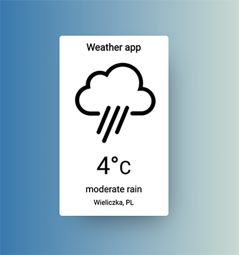

# Weather App with Javascript and OpenWeatherMap API

Weather app read JSON file from OpenWeatherMap




[Watch demo](https://haendzel.github.io/weather-app-js/) 📺 

There is API link.

```bash
let api = 'http://api.openweathermap.org/data/2.5/weather?lat=' + latitude + '&lon=' + longitude + '&appid=' + key;
```

Add your api key here. You must download your private key from OpenWeatherMap. 
It will be ready after 2 hours.

```bash
const key = "..."; //api key
```

| Technology stack I used in this project |
|--------------|
|HTML5 |
|CSS3 / Sass |
|Javascript with ES6 standard |
|Fetch API|
|JSON|
|Gulp |
|npm |

